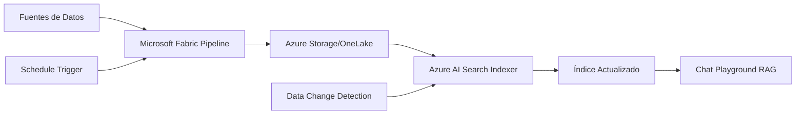

# 🔄 Estrategia de Indexación Automatizada para Data Assets

## 🎯 OBJETIVO: Automatización Completa de Datos Actualizables

Para tu caso donde los datos se actualizan constantemente y necesitas que el RAG siempre tenga la información más reciente sin intervención manual.

---

## 🏗️ ARQUITECTURA RECOMENDADA



---

## 🚀 ESTRATEGIA 1: Indexación Directa desde Storage (RECOMENDADO)

### 1.1 Configuración de Indexer Sin Skillset

```json
{
  "name": "automated-data-indexer",
  "description": "Indexer automatizado para datos actualizables",
  "dataSourceName": "azure-storage-datasource",
  "targetIndexName": "dynamic-knowledge-base",
  "schedule": {
    "interval": "PT1H",  // Cada hora
    "startTime": "2024-01-08T00:00:00Z"
  },
  "fieldMappings": [
    {
      "sourceFieldName": "content", 
      "targetFieldName": "content"
    },
    {
      "sourceFieldName": "metadata_storage_name",
      "targetFieldName": "title"
    },
    {
      "sourceFieldName": "metadata_storage_path",
      "targetFieldName": "id",
      "mappingFunction": {
        "name": "base64Encode"
      }
    },
    {
      "sourceFieldName": "metadata_storage_last_modified",
      "targetFieldName": "last_updated"
    }
  ],
  "parameters": {
    "batchSize": 100,
    "maxFailedItems": 5,
    "configuration": {
      "dataToExtract": "contentAndMetadata",
      "parsingMode": "json",  // Para tus archivos JSONL
      "jsonArrayParsingMode": "jsonLines"  // CRÍTICO para JSONL
    }
  }
}
```

### 1.2 Índice Optimizado para Datos Dinámicos

```json
{
  "name": "dynamic-knowledge-base",
  "fields": [
    {
      "name": "id",
      "type": "Edm.String",
      "key": true,
      "searchable": false,
      "filterable": true,
      "retrievable": true
    },
    {
      "name": "content",
      "type": "Edm.String",
      "searchable": true,
      "filterable": false,
      "retrievable": true,
      "analyzer": "es.microsoft"
    },
    {
      "name": "title",
      "type": "Edm.String",
      "searchable": true,
      "filterable": true,
      "retrievable": true,
      "sortable": true
    },
    {
      "name": "source_file",
      "type": "Edm.String",
      "searchable": false,
      "filterable": true,
      "retrievable": true,
      "facetable": true
    },
    {
      "name": "data_type",
      "type": "Edm.String",
      "searchable": false,
      "filterable": true,
      "retrievable": true,
      "facetable": true
    },
    {
      "name": "last_updated",
      "type": "Edm.DateTimeOffset",
      "searchable": false,
      "filterable": true,
      "retrievable": true,
      "sortable": true,
      "facetable": false
    },
    {
      "name": "record_id",
      "type": "Edm.String",
      "searchable": false,
      "filterable": true,
      "retrievable": true
    },
    {
      "name": "is_active",
      "type": "Edm.Boolean",
      "searchable": false,
      "filterable": true,
      "retrievable": true,
      "facetable": true
    }
  ]
}
```

---

## 🔄 ESTRATEGIA 2: Pipeline Fabric + Azure Search

### 2.1 Fabric Pipeline con Trigger Automático

```python
# Fabric Pipeline - Data processing for automated indexing
from datetime import datetime
import json

def fabric_to_search_pipeline():
    """
    Pipeline que procesa datos desde Fabric y los prepara para indexación automática
    """
    
    # Configuración del pipeline
    pipeline_config = {
        "name": "fabric-to-search-automated",
        "schedule": {
            "frequency": "Hourly",  # Cada hora
            "interval": 1,
            "start_time": "2024-01-08T00:00:00Z"
        },
        "activities": [
            {
                "name": "ProcessUpdatedData",
                "type": "DataFlow",
                "inputs": ["raw_data_source"],
                "outputs": ["processed_data_sink"]
            },
            {
                "name": "TriggerSearchIndexer", 
                "type": "WebActivity",
                "dependsOn": ["ProcessUpdatedData"],
                "url": "https://busquedapoc.search.windows.net/indexers/automated-data-indexer/run",
                "method": "POST",
                "headers": {
                    "api-key": "tu-search-admin-key"
                }
            }
        ]
    }
    
    return pipeline_config

def prepare_jsonl_for_indexing(raw_data, data_type):
    """
    Preparar datos en formato JSONL optimizado para indexación automática
    """
    
    processed_records = []
    current_time = datetime.utcnow().isoformat() + "Z"
    
    for record in raw_data:
        # Crear contenido unificado
        if data_type == "competidores":
            content = f"Competidor: {record.get('nombre', '')} | ID: {record.get('id_competidor', '')} | Estado: {record.get('estatus', '')} | Orden: {record.get('orden', '')} | {'Local' if record.get('es_local') else 'Internacional'}"
            title = f"Competidor: {record.get('nombre', '')}"
            
        elif data_type == "empresas":
            content = f"Empresa: {record.get('nombre', '')} | ID: {record.get('id', '')} | Sector: {record.get('sector', '')} | Tipo: {record.get('tipo', '')}"
            title = f"Empresa: {record.get('nombre', '')}"
            
        elif data_type == "noticias":
            content = f"Noticia: {record.get('titulo', '')} | Fecha: {record.get('fecha', '')} | Contenido: {record.get('contenido', '')}"
            title = record.get('titulo', '')
            
        # Crear registro para indexación
        search_record = {
            "id": f"{data_type}_{record.get('id', hash(content) % 100000)}",
            "content": content,
            "title": title,
            "source_file": f"{data_type}.jsonl",
            "data_type": data_type,
            "last_updated": current_time,
            "record_id": str(record.get('id', '')),
            "is_active": record.get('estatus', '').upper() == 'ACTIVO' if 'estatus' in record else True
        }
        
        processed_records.append(search_record)
    
    return processed_records

# Ejemplo de procesamiento
sample_data = [
    {"id_competidor": 1, "nombre": "Claro", "estatus": "ACTIVO", "es_local": True},
    {"id_competidor": 2, "nombre": "Movistar", "estatus": "INACTIVO", "es_local": False}
]

processed = prepare_jsonl_for_indexing(sample_data, "competidores")
print("Datos preparados para indexación:", json.dumps(processed, indent=2))
```

### 2.2 Storage Structure para Automatización

```
azure-storage-container/
├── automated-indexing/
│   ├── competidores/
│   │   └── competidores_2024-01-08.jsonl
│   ├── empresas/
│   │   └── empresas_2024-01-08.jsonl
│   ├── noticias/
│   │   └── noticias_2024-01-08.jsonl
│   └── conceptos/
│       └── conceptos_2024-01-08.jsonl
└── archive/
    └── [archivos históricos]
```

---

## ⚙️ ESTRATEGIA 3: Change Detection + Incremental Updates

### 3.1 Configuración de Change Detection

```python
from azure.search.documents.indexes import SearchIndexerClient
from azure.core.credentials import AzureKeyCredential

def setup_change_detection():
    """
    Configurar detección de cambios para actualizaciones incrementales
    """
    
    # Data source con change detection
    datasource_config = {
        "name": "azure-storage-with-change-detection",
        "type": "azureblob",
        "credentials": {
            "connectionString": "tu-storage-connection-string"
        },
        "container": {
            "name": "automated-indexing",
            "query": "/competidores/"  # Carpeta específica
        },
        "dataChangeDetectionPolicy": {
            "@odata.type": "#Microsoft.Azure.Search.HighWaterMarkChangeDetectionPolicy",
            "highWaterMarkColumnName": "metadata_storage_last_modified"
        },
        "dataDeletionDetectionPolicy": {
            "@odata.type": "#Microsoft.Azure.Search.SoftDeleteColumnDeletionDetectionPolicy",
            "softDeleteColumnName": "is_deleted",
            "softDeleteMarkerValue": "true"
        }
    }
    
    return datasource_config

def create_incremental_indexer():
    """
    Crear indexer para actualizaciones incrementales
    """
    
    indexer_config = {
        "name": "incremental-data-indexer",
        "dataSourceName": "azure-storage-with-change-detection",
        "targetIndexName": "dynamic-knowledge-base",
        "schedule": {
            "interval": "PT15M",  # Cada 15 minutos
            "startTime": "2024-01-08T00:00:00Z"
        },
        "parameters": {
            "configuration": {
                "parsingMode": "jsonLines",
                "dataToExtract": "contentAndMetadata"
            }
        }
    }
    
    return indexer_config

# Implementar configuración
change_detection_config = setup_change_detection()
incremental_indexer_config = create_incremental_indexer()
```

---

## 🔍 ESTRATEGIA 4: Monitoring y Validación Automática

### 4.1 Sistema de Monitoreo

```python
import logging
from datetime import datetime, timedelta

def setup_automated_monitoring():
    """
    Configurar monitoreo automático del pipeline de indexación
    """
    
    monitoring_config = {
        "alerts": [
            {
                "name": "IndexerFailureAlert",
                "condition": "indexer_status != 'success'",
                "action": "send_email",
                "recipients": ["admin@empresa.com"]
            },
            {
                "name": "DataFreshnessAlert", 
                "condition": "last_update_age > 2 hours",
                "action": "send_teams_notification"
            },
            {
                "name": "SearchQualityAlert",
                "condition": "search_results_count < expected_minimum",
                "action": "trigger_reindex"
            }
        ],
        "health_checks": [
            "indexer_status",
            "document_count",
            "last_successful_run",
            "error_rate",
            "index_size"
        ]
    }
    
    return monitoring_config

def validate_automated_indexing():
    """
    Validar que la indexación automática está funcionando correctamente
    """
    
    from azure.search.documents import SearchClient
    from azure.search.documents.indexes import SearchIndexerClient
    
    search_client = SearchClient(
        endpoint="https://busquedapoc.search.windows.net",
        index_name="dynamic-knowledge-base",
        credential=AzureKeyCredential("tu-search-key")
    )
    
    indexer_client = SearchIndexerClient(
        endpoint="https://busquedapoc.search.windows.net",
        credential=AzureKeyCredential("tu-admin-key")
    )
    
    validation_results = {}
    
    # 1. Verificar estado del indexer
    try:
        indexer_status = indexer_client.get_indexer_status("incremental-data-indexer")
        validation_results["indexer_status"] = indexer_status.status
        validation_results["last_run"] = indexer_status.last_result.end_time if indexer_status.last_result else None
        validation_results["error_count"] = indexer_status.last_result.error_count if indexer_status.last_result else 0
    except Exception as e:
        validation_results["indexer_error"] = str(e)
    
    # 2. Verificar frescura de datos
    try:
        # Buscar documentos más recientes
        recent_docs = search_client.search(
            "*",
            top=10,
            order_by=["last_updated desc"]
        )
        
        latest_doc = next(recent_docs, None)
        if latest_doc:
            last_update = datetime.fromisoformat(latest_doc['last_updated'].replace('Z', ''))
            age_hours = (datetime.utcnow() - last_update).total_seconds() / 3600
            validation_results["data_freshness_hours"] = round(age_hours, 2)
            validation_results["is_data_fresh"] = age_hours < 2  # Menos de 2 horas
        
    except Exception as e:
        validation_results["data_freshness_error"] = str(e)
    
    # 3. Verificar cantidad de documentos
    try:
        doc_count_result = search_client.search("*", include_total_count=True, top=0)
        validation_results["total_documents"] = doc_count_result.get_count()
    except Exception as e:
        validation_results["document_count_error"] = str(e)
    
    # 4. Probar búsqueda de calidad
    try:
        test_queries = ["competidores activos", "empresas telecomunicaciones", "noticias recientes"]
        search_quality = {}
        
        for query in test_queries:
            results = list(search_client.search(query, top=5))
            search_quality[query] = {
                "results_count": len(results),
                "has_content": all(r.get('content') for r in results)
            }
        
        validation_results["search_quality"] = search_quality
        
    except Exception as e:
        validation_results["search_quality_error"] = str(e)
    
    return validation_results

# Función para ejecutar validación periódica
def periodic_validation():
    """
    Ejecutar validación periódica y generar reporte
    """
    results = validate_automated_indexing()
    
    print("🔍 VALIDACIÓN DE INDEXACIÓN AUTOMÁTICA")
    print("=" * 50)
    print(f"📊 Estado del indexer: {results.get('indexer_status', 'Desconocido')}")
    print(f"🕐 Última ejecución: {results.get('last_run', 'N/A')}")
    print(f"📋 Total documentos: {results.get('total_documents', 'N/A')}")
    print(f"⏰ Frescura de datos: {results.get('data_freshness_hours', 'N/A')} horas")
    print(f"✅ Datos frescos: {'Sí' if results.get('is_data_fresh', False) else 'No'}")
    
    if results.get('search_quality'):
        print("\n🔍 Calidad de búsqueda:")
        for query, quality in results['search_quality'].items():
            print(f"  '{query}': {quality['results_count']} resultados")
    
    return results

# Ejecutar validación
validation_report = periodic_validation()
```

---

## 📅 ESTRATEGIA 5: Schedule Optimization

### 5.1 Configuración de Schedules Inteligentes

```yaml
Estrategias de Scheduling según Frecuencia de Actualización:

Datos de Alta Frecuencia (Noticias):
  ✅ Schedule: Cada 15 minutos
  ✅ Change Detection: HighWaterMark
  ✅ Incremental: True

Datos de Media Frecuencia (Competidores):
  ✅ Schedule: Cada 1 hora  
  ✅ Change Detection: LastModified
  ✅ Incremental: True

Datos de Baja Frecuencia (Conceptos):
  ✅ Schedule: Diario
  ✅ Full Refresh: Una vez por semana
  ✅ Incremental: Resto de días

Configuración Inteligente:
  - Horario pico: Indexación cada 15 min
  - Hora
