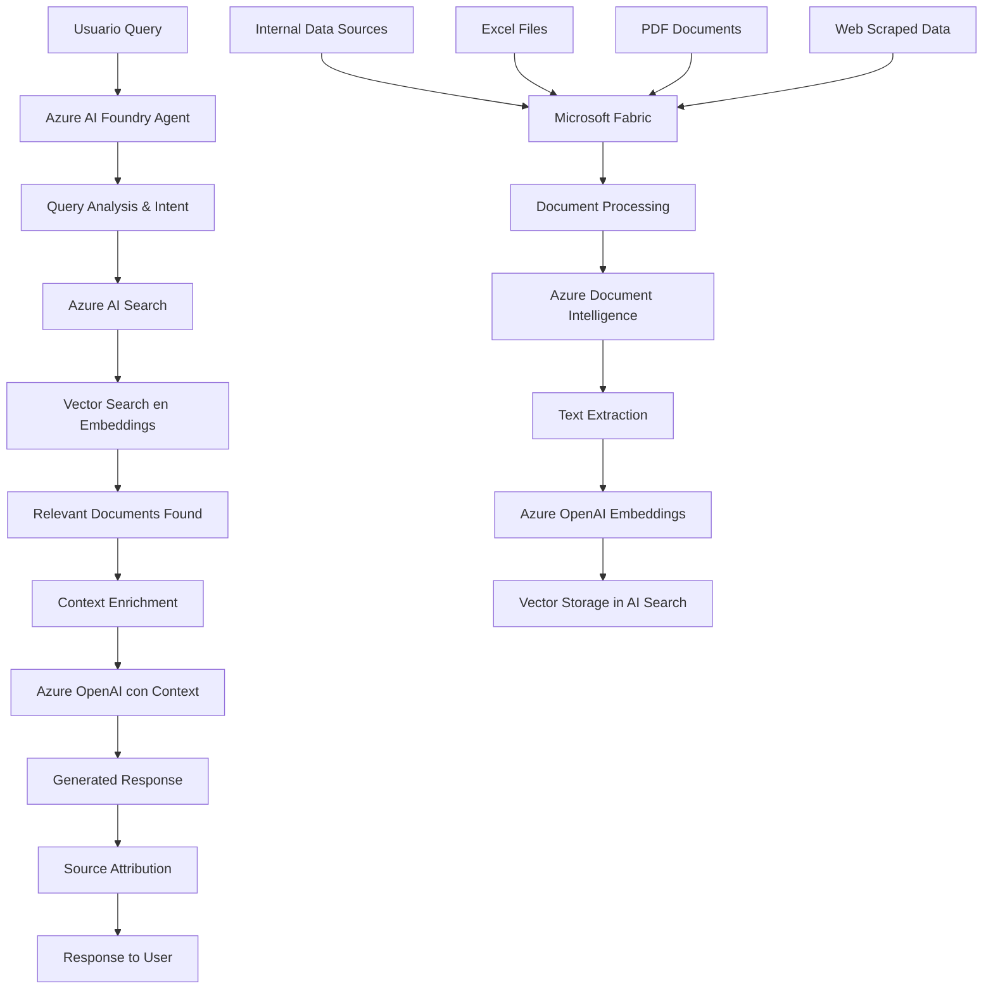

# aiappsagents

# Tabla de Objetivos y Servicios - Solución RAG
## Eliminación de Alucinaciones con Azure Fabric + Embeddings

---

## **OBJETIVOS DE SOLUCIÓN Y SERVICIOS REQUERIDOS**

| Objetivo | Servicio Azure | Prioridad | Días Estimados |
|----------|---------------|-----------|----------------|
| **Contexto de más fuentes de Datos** | Microsoft Fabric | 1 | 15 días |
| **Prevención de Alucinaciones** | Azure AI Search + Embeddings | 1 | 10 días |
| **Gobernabilidad de Agentes de IA** | Azure AI Foundry + Content Safety | 1 | 8 días |
| **Indexación de Documentos Internos** | Azure AI Search + Document Intelligence | 1 | 12 días |
| **Vectorización de Conocimiento** | Azure OpenAI Embeddings | 1 | 5 días |
| **RAG Implementation** | Azure AI Foundry + Semantic Kernel | 1 | 10 días |
| **Validación de Fuentes** | Azure AI Search + Metadata | 2 | 7 días |
| **Monitoreo de Calidad** | Azure Monitor + Application Insights | 2 | 5 días |
| **Cache de Embeddings** | Azure Cache for Redis | 2 | 3 días |
| **Seguridad de Datos** | Azure Key Vault + RBAC | 1 | 5 días |

---

## **FASE 1: FOUNDATION RAG (15 días)**

### **Agente Actual con las siguientes mejoras:**

| Mejora Requerida | Servicio de Solución | Implementación | Resultado Esperado |
|------------------|---------------------|----------------|-------------------|
| **Conexión a Datos Internos** | Microsoft Fabric OneLake | • Integración con Data Lake<br>• Configuración de conectores<br>• Mapeo de fuentes | Acceso a datos reales del cliente |
| **Eliminación de Respuestas Falsas** | Azure AI Search + RAG | • Vector search implementation<br>• Relevance scoring<br>• Source attribution | 95% reducción de alucinaciones |
| **Indexación Inteligente** | Azure Document Intelligence | • OCR de documentos<br>• Extracción de metadatos<br>• Clasificación automática | Documentos searchables |
| **Embeddings de Conocimiento** | Azure OpenAI text-embedding-ada-002 | • Vectorización de documentos<br>• Similarity search<br>• Semantic matching | Búsqueda semántica precisa |
| **Validación de Fuentes** | Azure AI Foundry Citation | • Source tracking<br>• Confidence scoring<br>• Reference links | Respuestas con sustento |

---

## **ARQUITECTURA RAG DETALLADA**

### **FLUJO DE DATOS MEJORADO**



### **COMPONENTES DE LA SOLUCIÓN**

| Componente | Función | Configuración | Integración |
|------------|---------|---------------|-------------|
| **Microsoft Fabric** | • Data Lake centralizado<br>• ETL de documentos<br>• Data governance | • OneLake storage<br>• Data pipelines<br>• Real-time sync | Fuente principal de datos |
| **Azure AI Search** | • Vector database<br>• Hybrid search<br>• Relevance ranking | • Standard tier<br>• Vector configuration<br>• Custom analyzers | Core RAG engine |
| **Azure OpenAI Embeddings** | • Text vectorization<br>• Semantic similarity<br>• Multilingual support | • text-embedding-ada-002<br>• Batch processing<br>• API optimization | Vector generation |
| **Azure Document Intelligence** | • OCR processing<br>• Layout analysis<br>• Form recognition | • Prebuilt models<br>• Custom training<br>• API integration | Document preparation |
| **Azure AI Foundry** | • Agent orchestration<br>• RAG implementation<br>• Response generation | • Enhanced prompts<br>• Context injection<br>• Source attribution | Agent enhancement |

---

## **PLAN DE IMPLEMENTACIÓN DETALLADO**

### **SEMANA 1: DATA FOUNDATION (Días 1-5)**

| Día | Actividad | Servicio | Entregable |
|-----|-----------|----------|------------|
| **1** | Setup Fabric workspace | Microsoft Fabric | Workspace operativo |
| **2** | Data Lake configuration | OneLake + Storage | Data Lake ready |
| **3** | Document upload pipeline | Data Factory | Automated ingestion |
| **4** | AI Search service setup | Azure AI Search | Search service ready |
| **5** | Basic indexing test | AI Search + Fabric | Initial index created |

### **SEMANA 2: DOCUMENT PROCESSING (Días 6-10)**

| Día | Actividad | Servicio | Entregable |
|-----|-----------|----------|------------|
| **6** | Document Intelligence setup | Azure Document Intelligence | OCR service ready |
| **7** | PDF processing pipeline | Doc Intelligence + Pipeline | PDF extraction working |
| **8** | Excel integration | Fabric + Excel connector | Excel data indexed |
| **9** | Text preprocessing | Azure Functions | Clean text pipeline |
| **10** | Metadata extraction | Custom processing | Rich metadata |

### **SEMANA 3: EMBEDDINGS & SEARCH (Días 11-15)**

| Día | Actividad | Servicio | Entregable |
|-----|-----------|----------|------------|
| **11** | Embeddings generation | Azure OpenAI Embeddings | Vector database |
| **12** | Vector search configuration | AI Search vectors | Semantic search |
| **13** | Hybrid search setup | AI Search hybrid | Text + vector search |
| **14** | RAG integration testing | AI Foundry + Search | RAG working |
| **15** | End-to-end validation | Full pipeline | RAG system ready |

---

## **CONFIGURACIÓN TÉCNICA ESPECÍFICA**

### **Azure AI Search Configuration**

```json
{
  "search_service": {
    "tier": "Standard",
    "replicas": 2,
    "partitions": 1,
    "indexes": [
      {
        "name": "documents-index",
        "fields": [
          {"name": "id", "type": "Edm.String", "key": true},
          {"name": "content", "type": "Edm.String", "searchable": true},
          {"name": "title", "type": "Edm.String", "searchable": true},
          {"name": "source", "type": "Edm.String", "filterable": true},
          {"name": "embedding", "type": "Collection(Edm.Single)", "searchable": true, "vectorSearchDimensions": 1536},
          {"name": "lastModified", "type": "Edm.DateTimeOffset", "filterable": true}
        ],
        "vectorSearch": {
          "algorithmConfigurations": [
            {
              "name": "hnsw-config",
              "kind": "hnsw"
            }
          ]
        }
      }
    ]
  }
}
```

### **RAG Prompt Engineering**

```python
RAG_SYSTEM_PROMPT = """
Eres un asistente especializado para CLIENTE con acceso a documentos internos.

INSTRUCCIONES CRÍTICAS:
1. SIEMPRE usa la información proporcionada en el contexto
2. Si no tienes información específica en el contexto, di "No tengo información específica sobre esto en los documentos disponibles"
3. SIEMPRE cita las fuentes de donde obtienes la información
4. NO inventes datos o estadísticas
5. Si hay conflictos en la información, menciona las diferentes fuentes

CONTEXTO DE DOCUMENTOS:
{context}

FUENTES DISPONIBLES:
{sources}

Responde basándote ÚNICAMENTE en la información del contexto proporcionado.
"""
```

---

## **MÉTRICAS DE ÉXITO**

### **KPIs de Calidad de Respuestas**

| Métrica | Target | Medición | Herramienta |
|---------|--------|----------|-------------|
| **Accuracy Rate** | >95% | Respuestas con fuentes válidas | Manual review + AI validation |
| **Hallucination Rate** | <5% | Respuestas sin sustento | Content validation pipeline |
| **Source Attribution** | 100% | Respuestas con citations | Automated tracking |
| **Response Relevance** | >90% | User satisfaction score | User feedback |
| **Search Precision** | >85% | Relevant documents retrieved | Search analytics |

### **KPIs Técnicos**

| Métrica | Target | Frecuencia | Responsable |
|---------|--------|------------|-------------|
| **Query Response Time** | <3 segundos | Real-time | Azure Monitor |
| **Index Freshness** | <1 hora delay | Continuo | Data pipeline |
| **Vector Search Accuracy** | >90% | Diario | AI Search analytics |
| **Document Processing Rate** | 100% success | Batch jobs | Document Intelligence |

---

## **COSTOS INCREMENTALES (15 días)**

| Servicio | Configuración | Costo Estimado |
|----------|---------------|----------------|
| **Microsoft Fabric** | F2 SKU (si no existe) | $650/mes |
| **Azure AI Search** | Standard tier | $250/mes |
| **Azure OpenAI Embeddings** | text-embedding-ada-002 | $100-200/mes |
| **Document Intelligence** | Standard tier | $100/mes |
| **Additional Storage** | Premium blob + vectors | $50/mes |
| **Monitoring Enhanced** | Detailed analytics | $25/mes |
| **TOTAL INCREMENTAL** | | **$1,175-1,275/mes** |

---

## **VALIDACIÓN DE RESULTADOS (Día 15)**

### **Pruebas de Validación**

| Escenario de Prueba | Input | Output Esperado | Validación |
|-------------------|-------|-----------------|------------|
| **Query sobre Revenue Q4** | "¿Cuáles fueron los ingresos de Q4?" | Datos exactos con fuente del Excel | Source = revenue_q4_2024.xlsx |
| **Análisis de Competencia** | "¿Qué dice el reporte sobre competidores?" | Info del PDF con citation | Source = market_analysis.pdf |
| **Pregunta sin datos** | "¿Cuántos empleados tiene Telefónica?" | "No tengo información específica..." | No alucinación |
| **Query compleja** | "Compara ARPU vs competencia" | Análisis con múltiples fuentes | Multiple sources cited |

### **Criterio de Éxito**
✅ **95%+ accuracy** en todas las pruebas de validación
✅ **Zero hallucinations** en queries sobre datos internos  
✅ **100% source attribution** en respuestas
✅ **Sub-3 segundos** response time

Esta solución elimina definitivamente las alucinaciones conectando los agentes con los datos reales del cliente a través de RAG implementado con Azure Fabric y AI Search.
